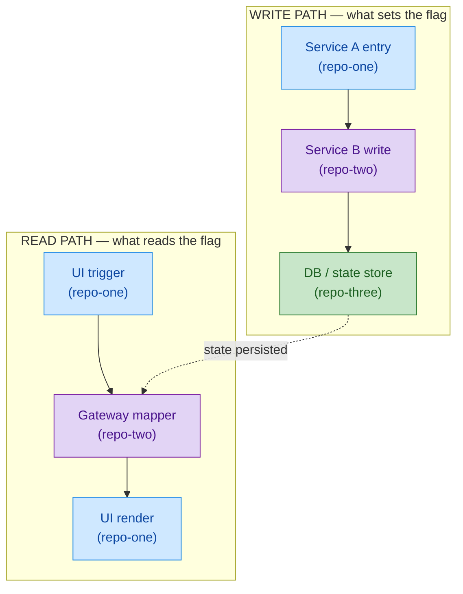

# Explore and Implement

A structured workflow for taking ambiguous requirements and turning them into
well-understood, targeted code changes. Prioritizes the user's understanding
of the system over speed of implementation.

## Core Principle

**Never implement without understanding.** The user should be able to explain
*why* a change is made in a specific file, *how* data flows to that point, and
*what* downstream effects the change has — before any code is written.

## Workflow

### Phase 1: Gather Requirements

1. Read the requirements source (Obsidian work page, Jira ticket, Slack thread, or user description).
2. Summarize the goal in plain language and confirm with the user:
   - **What** behavior needs to change?
   - **Who** is affected (end-user, agent, system)?
   - **Where** does the user *think* the change goes (if they have a guess)?
3. Identify unknowns — what do we need to figure out before we can act?

### Phase 2: Map the System

Trace the data/control flow that relates to the requirement. Work outward
from whatever is known:

1. **Start from what we know** — a flag name, a UI element, an API field, a class name.
2. **Search the current workspace repos** using Grep, Glob, and code exploration.
3. **Search across repos** using Sourcegraph when the flow crosses repo boundaries.
4. **Read internal docs** using Glean MCP or Confluence for architecture context.
5. **Ask the user to add repos** to the workspace when the trail leads outside the current repos.

At each step, explain what you found and how it connects to what we already know.
Build the picture incrementally with the user.

#### Tracing Techniques

- **Flag/field tracing**: Search for a field name across repos to see where it's set, mapped, and consumed.
- **API contract tracing**: Find the DTO/model that carries a field, then find who produces and consumes that DTO.
- **UI-to-backend tracing**: Start from a UI element, find what data it reads, trace that data back through API calls to the source.
- **Backend-to-UI tracing**: Start from a backend computation, trace the field through DTOs, API responses, and UI rendering.

### Phase 3: Present the Flow

Once the full path is traced, present two complementary views:

**(a) Numbered data flow summary** showing:

- Each service/layer involved
- The specific file, class, and function at each step
- How data transforms between steps
- Short code snapshots (5-15 lines) of the key logic at each step

Example format:

```
## Data Flow: [Feature Name]

1. **[Service A] — [Class.method()]** (`path/to/file.scala`)
   - [What happens here]

2. **[Service B] — [Class.method()]** (`path/to/file.scala`)
   - [What happens here, how it connects to step 1]

...
```

**(b) Mermaid data-flow diagram** — REQUIRED whenever the flow crosses **two or more services/repos**. Prose alone is hard to hold in your head across 4+ hops; a diagram is not optional for cross-service work.

Guidelines for the diagram:

- Use `flowchart TD` (or `LR` if the flow is short and wide).
- Split by **path**, not by repo: use `subgraph` for logical phases like WRITE PATH vs READ PATH, happy path vs error path, etc. This is common for "where does this flag come from?" questions — connect the two subgraphs with a dotted edge labeled with what's persisted between them (e.g. `A6 -. customer state persisted .-> B3`).
- Tag every node with its repository in parentheses on its own line: `"Description of what happens<br/>(repo-name)"`. Wrap labels in double quotes whenever they contain parentheses, commas, or other special characters — `A1["User submits BWZP<br/>(agoda-com-spa-mobile)"]`.
- **Color every node by the repository it lives in**, using `classDef` + `class` (not per-node `style`). One class per repo, reused consistently across subgraphs — so the same repo reads as the same color in both the write and read paths. This makes the "who owns this hop" question answerable at a glance.
- Keep node labels short: the method/class or one-line intent on the first line(s), repo name on the last line.
- **Name the concrete endpoint or method at every hop**, not the vague action. "User submits BWZP" is not enough; the node must say `POST /api/BookingsV2/Create` or `submitNoCcBooking → itineraryCreate`. If you don't know the endpoint/method yet, keep tracing — don't ship a diagram with hand-waved hops. After drafting, re-read each node and ask "which file did I find this in?" — if the answer is "I assumed", go verify before presenting.
- **Don't collapse request/response loops into one node.** Flows that involve OTP, captcha, 3DS, polling, retries, or any round-trip with user input in between are multiple hops, not one. A WhatsApp OTP verification is at least: (1) 1st API call with phone only, (2) server sends OTP to user, (3) user enters code, (4) 2nd API call with OTP code, (5) server verifies + persists. Four nodes minimum. If two consecutive nodes call the *same* endpoint, that's usually a signal a loop exists — say so explicitly (e.g. label them "1st POST /foo" and "2nd POST /foo").
- Avoid Unicode arrows like `⇒`, `⊇`; stick to ASCII. Parentheses inside node text are fine **when the label is wrapped in double quotes**.

Default color palette (reuse across diagrams so repos read consistently across your notes):

| Repo                  | Fill      | Stroke    |
| --------------------- | --------- | --------- |
| agoda-com-spa-mobile  | `#cfe8ff` | `#1e88e5` |
| Agoda-Gateway         | `#e2d4f5` | `#7b1fa2` |
| ul-sdk                | `#ffd9b3` | `#e65100` |
| ul-cronos             | `#fff3cd` | `#f9a825` |
| customer-api          | `#c8e6c9` | `#2e7d32` |
| booking-bff           | `#ffd6d6` | `#c62828` |
| property-bff          | `#d7ccc8` | `#5d4037` |

Add a new row for any repo not in this list, picking a distinct fill/stroke pair, and use it consistently thereafter.

Example shape (adapt to the specific flow):



Ask the user: *"Does this flow make sense? Any questions before we proceed?"*

### Phase 4: Identify Changes

Based on the traced flow, propose the minimal set of changes:

1. **Where** — exact file(s) and function(s) to modify.
2. **What** — the logic change in plain language.
3. **Why here** — explain why this is the right layer/service for the change.
4. **Downstream effect** — what happens automatically because of this change (e.g., flag propagates through DTOs without extra work).

Confirm the plan with the user before writing any code.

### Phase 5: Implement

Only after the user confirms understanding:

1. Make the code change.
2. Write/update tests.
3. Show the user the change and explain it.
4. Run compilation, tests, and formatting per project rules.

### Phase 6: Summarize

After implementation, provide a concise summary:

- What was changed and why.
- The full data flow path (for future reference).
- Any follow-up items or related areas to watch.

When saving to the user's knowledge base (Obsidian work page, etc.):

- Keep the daily-log / "Latest Update" entry **short** — one or two lines that point to the implementation section. It is a log entry, not a design doc.
- Put the full detail (rationale, chosen approach, trade-offs, operational gates) in the **Implementation Details** section.
- Always include the **mermaid data-flow diagram** from Phase 3 in Implementation Details — it is the single most re-readable artifact for the next person (or future you) picking this up.

## Interaction Guidelines

- **Explain as you go** — don't silently search 10 files and dump a conclusion. Share findings incrementally.
- **Use visuals** — numbered flows, short code snapshots, clear file paths, and mermaid diagrams (see Phase 3) help the user build a mental model. For cross-service flows the mermaid diagram is mandatory, not optional.
- **Pause at decision points** — when you find something significant (e.g., "this flag doesn't reach the UI directly"), stop and discuss it with the user.
- **Suggest repos to add** — if the trace leads to a repo not in the workspace, tell the user which repo and why.
- **Use internal tools** — Glean MCP for docs, Sourcegraph for cross-repo search, Confluence for architecture diagrams.
- **Don't over-implement** — if the user asks "how does X work?", explain it. Don't jump to changing code.
- **Confirm before coding** — always get explicit confirmation before making changes.

## Anti-Patterns

- Implementing a fix before the user understands the system.
- Searching silently for 5 minutes then presenting a wall of findings.
- Assuming the user knows which service/layer is responsible.
- Making changes in multiple repos when one targeted change is sufficient.
- Skipping the "why here" explanation.
