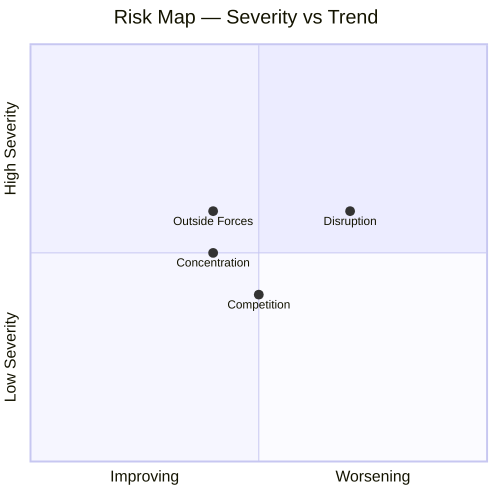

# Stock Analysis Skill

## Purpose

Produce a comprehensive 8-step investment research report for any publicly traded company, given only a name and/or ticker. Save a two-section Obsidian note: a quick-read summary (Section 1) and full deep-dive (Section 2).

## Obsidian Save Path

Each company gets its own folder. Structure:

```
~/Library/Mobile Documents/iCloud~md~obsidian/Documents/CupOb/Investment/Stock Analysis/
  [TICKER] - [Company Name]/
    [Company Name] - Stock Analysis.md     ← main analysis note
    references/
      financial-data.md                    ← key metrics from yfinance script
      ceo-letter.md                        ← extracted from annual report
      business-overview.md
      mda.md
      corporate-governance.md
      risk-factors.md
      esg-sustainability.md
      auditor-report.md
```

Folder naming convention: `[TICKER] - [Company Name]`

Examples:
```
.../Stock Analysis/BDMS.BK - Bangkok Dusit Medical Services/
.../Stock Analysis/AAPL - Apple/
.../Stock Analysis/D05.SI - DBS Group/
```

Use the `Write` tool to save all files. Create the folder and `references/` subfolder as needed — Obsidian creates folders automatically when you write a file to a new path.

### What to save in references/

- **`financial-data.md`** — formatted summary of all key yfinance metrics (price, valuation, financials, growth, dividends, analyst consensus). Format as a readable markdown table, not raw JSON.
- **`ceo-letter.md`**, **`business-overview.md`**, **`mda.md`**, **`corporate-governance.md`**, **`risk-factors.md`**, **`esg-sustainability.md`**, **`auditor-report.md`** — text extracted from the annual report via web fetch or direct PDF read. Only save sections that were actually obtained (skip if unavailable).

Save references **before** writing the main analysis note.

---

## Workflow

### Step 0: Confirm the company

If only a ticker is given, confirm the full company name before proceeding. If both are given, proceed immediately.

### Research Pass (before Step 1)

**Step A: Run the data fetcher script first.**

```bash
python ~/.claude/skills/stock-analysis/scripts/fetch_stock_data.py <TICKER>
```

- Ticker format: Thai SET → `SCB.BK`, US → `AAPL`, SGX → `D05.SI`, Vietnam → `VIC.VN`, HK → `9988.HK`
- This produces a JSON with real-time price, valuation, margins, ROE, dividends, EPS history, analyst consensus, management, and SET index comparison
- Read the JSON output before starting any step — it is your primary data source
- Fields that are `null` were unavailable from yfinance — fall back to training knowledge for those and flag with ⚠️

**What the script covers (use these directly, no web fetching needed):**

| Field | JSON path |
|-------|-----------|
| Price, 52w range, MAs | `price.*` |
| P/BV, P/E, EPS | `valuation.*` |
| Revenue, Net Income, OCF | `financials_ttm.*` |
| ROE, ROA, margins | `profitability.*` |
| Revenue/earnings growth YoY | `growth_yoy.*` |
| Dividend yield, history, payout | `dividends.*` |
| EPS 4-year history + 3YR CAGR | `earnings_history.*`, `derived.eps_3yr_cagr_pct` |
| FCF/NI, dividend coverage | `derived.*` |
| Analyst target, recommendation | `analyst_consensus.*` |
| C-suite officer list | `management.*` |
| Insider/institutional ownership | `ownership.*` |
| 1Y price change, volume | `price_1y.*` |
| vs SET/index return | `market_comparison.*` |

**Step B: Fetch the annual report sections via web.**

Locate and fetch the annual report directly. Target these sections:

| Section | Contains | Used in |
|---------|----------|---------|
| CEO/Chairman Letter | Tone, priorities, strategic framing | Step 2 (Management) |
| Business Overview | What the company does, products, customers | Step 3 (Business) |
| MD&A | Management commentary on performance, trends, outlook | Step 5 & 6 |
| Corporate Governance | Board structure, independence, committees | Step 2 (Governance) |
| Risk Factors | Formally disclosed risks | Step 7 (Risks) |
| ESG/Sustainability | Environmental/social disclosures | Step 3 |
| Auditor Report | Going concern flags, key audit matters | Step 5 |

**Where to find the annual report by exchange:**
- **US (NYSE/NASDAQ)**: SEC EDGAR 10-K — https://www.sec.gov/cgi-bin/browse-edgar?action=getcompany&CIK=[TICKER]&type=10-K
- **US ADR**: SEC EDGAR 20-F — same URL with type=20-F
- **Thailand (SET)**: Company IR page → Annual Report / 56-1 One Report
- **Singapore (SGX)**: Company IR page → Annual Report
- **Vietnam / HK / others**: Company IR page

**Fetch protocol:**
1. Try fetching the URL directly using the built-in `WebFetch` tool
2. If `WebFetch` is blocked or returns an error, invoke the `web-fetch` skill as fallback (it uses Gemini CLI which can access more sites)
3. If the user provides a PDF path directly, read it with the `Read` tool — no script needed
4. If all fetches fail, fall back to training knowledge and flag with ⚠️

**Step C: Data Availability Report — show this to the user and WAIT for confirmation before proceeding.**

After running both scripts, compile a data availability report and present it to the user. Do NOT start the 8-step analysis until the user confirms they want to proceed (or provides additional documents).

Format the report exactly like this:

---

**Data Availability Report - [COMPANY NAME] ([TICKER])**

**Financial Data (yfinance)**

| Field | Status | Notes |
|-------|--------|-------|
| Price & Valuation (P/E, P/BV, EPS) | ✅ / ⚠️ | |
| Profitability (ROE, margins) | ✅ / ⚠️ | |
| Revenue & Net Income (TTM) | ✅ / ⚠️ | |
| EPS History (3-4 year CAGR) | ✅ / ⚠️ | |
| Dividend history | ✅ / ⚠️ | |
| Analyst consensus | ✅ / ⚠️ | |

Mark ✅ if the field has actual data, ⚠️ if all or most values are null (will fall back to training knowledge).

**Annual Report Sections**

| Section | Status | Affects |
|---------|--------|---------|
| CEO/Chairman Letter | ✅ Found / ❌ Missing | Step 2 (Management tone, priorities) |
| Business Overview | ✅ Found / ❌ Missing | Step 3 (Business model, products) |
| MD&A | ✅ Found / ❌ Missing | Step 5 (Financial commentary), Step 6 (Outlook) |
| Corporate Governance | ✅ Found / ❌ Missing | Step 2 (Board structure) |
| Risk Factors | ✅ Found / ❌ Missing | Step 7 (Formal risk disclosures) |
| ESG/Sustainability | ✅ Found / ❌ Missing | Step 3 (ESG profile) |
| Auditor Report | ✅ Found / ❌ Missing | Step 5 (Going concern flags) |

**Section Truncation Status** (only show this table if any found section was truncated)

For each section that was extracted, check whether it hit the word limit. Parse the extracted text for the truncation marker `[... truncated at X of Y words ...]`. Show:

| Section | Words Captured | Total Words | Coverage | Priority |
|---------|---------------|-------------|----------|----------|
| Business Overview | X,XXX | X,XXX | XX% | 🔴 CRITICAL |
| Risk Factors | X,XXX | X,XXX | XX% | 🔴 CRITICAL |
| MD&A | X,XXX | X,XXX | XX% | 🟡 Important |
| CEO Letter | X,XXX | X,XXX | XX% | 🟡 Important |
| Corporate Governance | X,XXX | X,XXX | XX% | 🟢 Lower priority |
| ESG/Sustainability | X,XXX | X,XXX | XX% | 🟢 Lower priority |
| Auditor Report | X,XXX | X,XXX | XX% | 🟢 Lower priority |

- If a section was not truncated (full text captured), show "100%" in Coverage.
- If a section is Missing (❌), omit it from this table.
- Current word limits: business_overview 20,000 | risk_factors 20,000 | mda 12,000 | ceo_letter 8,000 | corporate_governance 5,000 | esg_sustainability 4,000 | auditor_report 3,000

**Overall Readiness**

Choose one:
- **Ready** — sufficient data to run all 8 steps with high confidence
- **Partial** — X of 7 annual report sections found; steps Y and Z will rely on training knowledge ⚠️
- **Limited** — annual report PDF not found; all narrative steps will rely on training knowledge ⚠️

**How to improve coverage** (only show if sections are missing or critically truncated):
- To provide the annual report manually: download the PDF and share the file path — Claude will read it directly with the `Read` tool
- Try the `web-fetch` skill if direct fetch was blocked
- For Vietnamese/HK companies: download the annual report PDF from the company's IR page and share the path

---

After presenting the report, ask: **"Shall I proceed with the full analysis, or would you like to adjust coverage for any sections first?"**

- If any CRITICAL section (business_overview, risk_factors) is below 80% coverage, explicitly flag this: *"Business Overview is only X% covered — some details may be missed in Step 3. Would you like to increase the limit before proceeding?"*
- The user can say "proceed" to continue as-is, or request a re-run with different limits.

Only continue to the 8-step analysis once the user confirms to proceed.

**Step D: Fetch 1-2 web sources for what neither script provides** — bank-specific metrics (NIM, NPL ratio, CAR, AUM) and recent news. Max 3 fetches total. Fall back to training knowledge for anything blocked. Do this after the user confirms to proceed.

Do NOT spawn background research agents for a single-company analysis. Run everything inline.

### Step 1-8: Run all analysis steps

Read each reference file below and follow its exact output format. Run all steps in sequence. The output from Step 1 (business phase determination) informs Step 5 (financial health metrics) — carry the phase result forward.

| Step | Topic | Reference File |
|------|-------|----------------|
| 1 | Business Growth Cycle Phase | `references/step1-business-phase.md` |
| 2 | Management & Governance | *(no fixed format — see below)* |
| 3 | Business Understanding | `references/step3-business-understanding.md` |
| 4 | Competitive Position (Moat) | `references/step4-moat.md` |
| 5 | Financial Health (Key Metrics) | `references/step5-financial-health.md` |
| 6 | Growth Drivers | `references/step6-growth-drivers.md` |
| 7 | Risks | `references/step7-risks.md` |
| 8 | Market / People Sentiment | `references/step8-sentiment.md` |

**Step 2 - Management & Governance** has no fixed template. Research freely:
- CEO/leadership background, tenure, and track record
- Board composition and independence
- Compensation structure and alignment with shareholders
- Insider ownership and recent transactions
- Any governance controversies or red flags
- Capital allocation philosophy

### Visualizations (required for these 4 sections)

Two charting tools are available — use whichever fits the chart type best. Do not skip charts — they make the report dramatically easier to scan.

---

#### Tool 1: Obsidian Charts plugin

Best for: bar charts, pie/doughnut, line trends, radar. Richer visual output than Mermaid for data charts.

```chart
type: pie          ← options: bar, line, pie, doughnut, polarArea, radar
labels: [Label1, Label2, Label3]
series:
  - title: My Data
    data: [70, 20, 10]
width: 70%
beginAtZero: true
```

**Bar chart example (financial scorecard) — color each bar by its score:**
```chart
type: bar
labels: [Revenue CAGR, FCF/NI, ROIC, Capital Returns, EBIT Cover]
series:
  - title: Score (3=Green, 2=Yellow, 1=Red)
    data: [2, 3, 2, 3, 3]
    backgroundColor:
      - rgba(234, 179, 8, 0.85)
      - rgba(34, 197, 94, 0.85)
      - rgba(234, 179, 8, 0.85)
      - rgba(34, 197, 94, 0.85)
      - rgba(34, 197, 94, 0.85)
width: 80%
beginAtZero: true
```

Color reference for score-based bars:
- 🟢 Score 3 (Strong/Green): `rgba(34, 197, 94, 0.85)`
- 🟡 Score 2 (Moderate/Yellow): `rgba(234, 179, 8, 0.85)`
- 🔴 Score 1 (Weak/Red): `rgba(239, 68, 68, 0.85)`

Always add `backgroundColor` to every chart — never leave it unset.

**Pie/doughnut chart example (revenue mix) — always include backgroundColor:**
```chart
type: doughnut
labels: [Net Interest Income, Fee Income, Wealth Mgmt, Other]
series:
  - title: Revenue Mix FY[YEAR]
    data: [70, 15, 12, 3]
    backgroundColor:
      - rgba(37, 99, 235, 0.85)
      - rgba(16, 185, 129, 0.85)
      - rgba(139, 92, 246, 0.85)
      - rgba(251, 146, 60, 0.85)
width: 60%
```

For pie/doughnut charts, always add `backgroundColor` with one rgba color per slice — otherwise all slices render the same color. Add more colors as needed for additional slices.

---

#### Tool 2: Mermaid

Best for: quadrant charts (risk maps), flow diagrams, anything structural.

**Quadrant chart example (risk map):**


---

**Required charts per section:**

| Section | Chart Type | Tool |
|---------|-----------|------|
| Step 3 - Revenue breakdown | Pie or doughnut by revenue segment | Obsidian Charts |
| Step 3 - Geographic split | Pie by region | Obsidian Charts |
| Step 5 - Financial scorecard | Bar showing metric scores | Obsidian Charts |
| Step 6 - Growth drivers | Pie or bar showing driver strengths | Obsidian Charts |
| Step 7 - Risk matrix | Quadrant (Severity × Trend) | Mermaid |

Add more charts wherever numbers benefit from visual comparison (moat scores, loan book composition, customer segment split, etc.).

### Step 9: Assemble the final note

Build the Obsidian note in two sections:

**Section 1 - Executive Summary** (quick read, ~1 page)
- Company name, ticker, date analyzed
- Business phase (from Step 1) with confidence level
- 3-sentence business description (from Step 3)
- Moat verdict: size + direction (from Step 4)
- Phase health scorecard (from Step 5): overall rating + green/yellow/red count
- Top 2 growth drivers (from Step 6)
- Top 2 risks (from Step 7)
- Market sentiment outlook: bullish/neutral/bearish (from Step 8)
- One-line investment thesis

**Section 2 - Deep Dive**
Full output from all 8 steps in order, each under its own `###` heading (one level below `## Section 2`).

**Section 3 - Final Assessment Checklist**

Add the checklist at the very end of the note (after Section 2). Populate it as follows:

- **Assess for All Phases**: leave all checkboxes empty — the user fills these in after reading
- **Key Metrics by Business Phase**: use the phase from Step 1. In the Phase Criteria Match table: non-matching cells show the criterion label + the threshold/range that defines that phase in parentheses (e.g. `Fast (>20%)`); the matching phase cells get ✅ in front + the company's actual number (e.g. `✅ Slow (6.65% 3YR CAGR, +4.3% YoY)`). Only the matching cell shows the real company number — all others show the phase definition range. Keep ONLY the metrics block for that phase — delete all other phase blocks. **Auto-fill the metric scores from Step 5**: for each metric row, replace `- [ ]` in the matching column with `- ` + the color emoji (🔴, 🟡, or 🟢) + the actual company value + the threshold in parentheses — e.g. `- 🟡 6.65% (5-10%)` or `- 🔴 41.2% (<50%)` or `- 🟢 57x (>5x)`. For the Capital Returns row, always specify the type — e.g. `- 🟢 Dividend — 24.5 yrs, 5.32% yield` or `- 🟢 Buyback — $2B/yr, 5 yrs`. Leave the non-matching cells as `- [ ]`. Do not leave any metric row blank — all must be pre-filled.
- **Assess Risk**: leave empty — user fills in based on their read of Step 7
- **Assess Valuation**: fill in the current P/E and P/FCF values from the financial data. For sector median, use training knowledge or flag with ⚠️ if unknown. Leave checkboxes empty.
- **Are You Interested?**: leave empty — this is the user's final verdict

### Step 10: Create the Products Page

Save a separate `[Company Name] - Products.md` file in the same folder as the main analysis note.

**Purpose:** Summarise all company products grouped by category so the investor can quickly understand what the company sells.

**File naming:** `[Company Name] - Products.md` (same folder as the main note)

**Structure:**
- Top-level `##` heading per business segment (e.g. `## 🌐 Google Services`, `## ☁️ Google Cloud`, `## 🚀 Other Bets`) — always include a fitting emoji
- Sub-section `###` heading per product category within a segment (e.g. `### 🔍 Search & Discovery`) — always include a fitting emoji
- Each sub-section is a two-column markdown table: `| Product | Description |`
- Description: one concise sentence max
- If the company has an "Other / Ventures / Investments" arm, list those in a flat table (Company + Category + Description)

**Highlighting significant revenue drivers:**
- Prefix the product name with `⭐` and **bold** it: `| ⭐ **Product Name** | ... |`
- Add revenue figures or % of total revenue to the description where known (e.g. `` `~$200B`, `~50%` of total revenue ``)
- Significant = product that directly generates a material share of company revenue (ads, subscriptions, cloud contracts, hardware sales)
- Do NOT mark internal tools, platforms that enable other products (e.g. Android OS, Chrome browser), or research divisions as ⭐ unless they generate standalone revenue

**Source:** Use the `business_overview.md` reference file as primary source. Supplement with training knowledge for products not explicitly listed there.

### Step 11: Save and confirm

Save in this order:
1. All `references/` files (financial-data.md + any extracted annual report sections)
2. The main `[Company Name] - Stock Analysis.md` note
3. The `[Company Name] - Products.md` note

Tell the user:
- Folder path created (e.g. `Stock Analysis/BDMS.BK - Bangkok Dusit Medical Services/`)
- Number of reference files saved
- The one-line investment thesis from Section 1

---

## Output Format (Note Structure)

```markdown
# [Company Name] ([TICKER]) - Stock Analysis
**Date:** [Today's date]
**Phase:** Phase [#] - [Phase Name] ([Confidence])

---

## Section 1 - Executive Summary

### Quick Snapshot
| Field | Value |
|-------|-------|
| Company | [Name] ([TICKER]) |
| Business Phase | Phase [#] - [Name] ([confidence emoji]) |
| Moat | [Size] [emoji] / [Direction] [emoji] |
| Phase Health | [🟢 Strong / 🟡 Mixed / 🔴 Weak] ([X]G [X]Y [X]R) |
| Market Sentiment | [🟢 Bullish / 🟡 Neutral / 🔴 Bearish] |
| Top Growth Drivers | [Driver 1], [Driver 2] |
| Top Risks | [Risk 1], [Risk 2] |

### Business in One Sentence
[Single sentence capturing what the company does and why it matters]

### Investment Thesis
[2-3 sentences: what makes this company interesting (or not) as an investment right now]

---

## Section 2 - Deep Dive

### Step 1 - Business Growth Cycle Phase
[Full Step 1 output]

### Step 2 - Management & Governance
[Step 2 findings]

### Step 3 - Business Understanding
[Full Step 3 output]

### Step 4 - Competitive Position (Moat)
[Full Step 4 output]

### Step 5 - Financial Health (Key Metrics)
[Full Step 5 output]

### Step 6 - Growth Drivers
[Full Step 6 output]

### Step 7 - Risks
[Full Step 7 output]

### Step 8 - Market / People Sentiment
[Full Step 8 output]

---

## Final Assessment Checklist

> Fill in these checkboxes after reading the full analysis. Check ONE box per row.

### Assess for All Phases

| | 🔴 Red | 🟡 Yellow | 🟢 Green |
|---|---|---|---|
| Business Description From 10k | - [ ] I'm Confused | - [ ] I Understand | - [ ] I'm Excited! |
| Moat | - [ ] None / Weakening | - [ ] Narrow / Stable | - [ ] Wide / Expanding |
| Long Term Potential | - [ ] Low or Negative | - [ ] Good | - [ ] Great |

---

### Key Metrics by Business Phase — Phase [#] - [PHASE NAME]

> Thresholds are phase-specific. The table below shows why this company is in this phase.

**Phase Criteria Match:**

| Criteria | P1 Startup | P2 Hyper Growth | P3 Self Funding | P4 Op Leverage | P5 Cap Return | P6 Decline |
|----------|------------|-----------------|-----------------|----------------|---------------|------------|
| Revenue | None/Small ([actual]) | Fast ([actual]) | Fast ([actual]) | Medium ([actual]) | ✅ Slow ([actual]) | Decline ([actual]) |
| Op Profit | Neg & Growing ([actual]) | Neg & Shrinking ([actual]) | Near Zero ([actual]) | Fast ([actual]) | ✅ Slow ([actual]) | Declining ([actual]) |
| Div/Buyback | No | No | No | No | ✅ Yes ([actual]) | Yes ([actual]) |
| Key Question | Can we find product/market fit? | Is this business sustainable? | Can we scale? | Can we maximize profits? | Can we reward investors? | Can we turn things around? |

*Copy from Step 1 output. Non-matching cells: show the phase's definition threshold (e.g. `Fast (>20%)`). Matching cell: ✅ + actual company number.*

[PASTE ONLY THE RELEVANT PHASE TABLE BELOW — DELETE THE REST]

**P1 - Startup:**

| | 🔴 Red | 🟡 Yellow | 🟢 Green |
|---|---|---|---|
| Revenue | - [ ] Declining | - [ ] Flat | - [ ] Growing |
| Gross Margin | - [ ] Declining | - [ ] Stable | - [ ] Improving |
| Cash Runway | - [ ] <12mo | - [ ] 12-24mo | - [ ] >24mo |
| Revenue vs Estimate | - [ ] Miss | - [ ] In-line | - [ ] Beat |
| SO 3YR CAGR (dilution) | - [ ] >5% | - [ ] 1-5% | - [ ] <1% |

**P2 - Hyper Growth:**

| | 🔴 Red | 🟡 Yellow | 🟢 Green |
|---|---|---|---|
| Revenue 3YR CAGR | - [ ] <5% | - [ ] 5-10% | - [ ] >10% |
| Gross Margin Direction | - [ ] Declining | - [ ] Stable | - [ ] Improving |
| Cash Runway | - [ ] <12mo | - [ ] 12-24mo | - [ ] >24mo |
| Revenue vs Estimate | - [ ] Miss | - [ ] In-line | - [ ] Beat |
| SO 3YR CAGR (dilution) | - [ ] >5% | - [ ] 1-5% | - [ ] <1% |

**P3 - Self Funding:**

| | 🔴 Red | 🟡 Yellow | 🟢 Green |
|---|---|---|---|
| Revenue 3YR CAGR | - [ ] <5% | - [ ] 5-10% | - [ ] >10% |
| Gross Margin Direction | - [ ] Declining | - [ ] Stable | - [ ] Improving |
| Operating Margin | - [ ] Neg & Worsening | - [ ] Improving | - [ ] Positive |
| Free Cash Flow | - [ ] Negative | - [ ] Near Zero | - [ ] Positive |
| SO 3YR CAGR (dilution) | - [ ] >5% | - [ ] 1-5% | - [ ] <1% |

**P4 - Operating Leverage:**

| | 🔴 Red | 🟡 Yellow | 🟢 Green |
|---|---|---|---|
| Revenue 3YR CAGR | - [ ] <5% | - [ ] 5-10% | - [ ] >10% |
| Operating Margin | - [ ] <5% | - [ ] 5-15% | - [ ] >15% |
| FCF Margin | - [ ] Negative | - [ ] 0-10% | - [ ] >10% |
| Earnings vs Estimate | - [ ] Miss | - [ ] In-line | - [ ] Beat |
| ROIC | - [ ] <10% | - [ ] 10-20% | - [ ] >20% |

**P5 - Capital Return:**

| | 🔴 Red | 🟡 Yellow | 🟢 Green |
|---|---|---|---|
| Revenue 3YR CAGR | - [ ] Less than 5% | - [ ] Between 5% and 10% | - [ ] Over 10% |
| FCF / Net Income | - [ ] Less than 50% | - [ ] Between 50% and 90% | - [ ] Over 90% |
| EBIT / Interest Expense | - [ ] Less than 2x | - [ ] Between 2x and 5x | - [ ] 5+ |
| ROIC | - [ ] Less than 10% | - [ ] Between 10% and 20% | - [ ] Over 20% |
| Capital Returns | - [ ] None | - [ ] Yes, Less than 5 Years | - [ ] Yes, 5+ Years |

**P6 - Decline:**

| | 🔴 Red | 🟡 Yellow | 🟢 Green |
|---|---|---|---|
| Revenue Trend | - [ ] Declining | - [ ] Stabilizing | - [ ] Recovering |
| Operating Margin | - [ ] Declining | - [ ] Stable | - [ ] Improving |
| FCF / Net Income | - [ ] <50% | - [ ] 50-90% | - [ ] >90% |
| Capital Returns | - [ ] None | - [ ] Yes <5yrs | - [ ] Yes 5+yrs |
| Turnaround Catalyst | - [ ] None visible | - [ ] Possible | - [ ] Clear |

---

### Assess Risk

| | 🔴 High | 🟡 Medium | 🟢 Low |
|---|---|---|---|
| Execution Risk | - [ ] High | - [ ] Medium | - [ ] Low |

---

### Assess Valuation

| | 🔴 Red - Overvalued | 🟡 Yellow - Fairly Valued | 🟢 Green - Undervalued |
|---|---|---|---|
| Primary: Price To Earnings (P/E) | - [ ] >20% Over Median | - [ ] Within 20% of Median | - [ ] >20% Below Median |
| Secondary: Price to Free Cash Flow (P/FCF) | - [ ] >20% Over Median | - [ ] Within 20% of Median | - [ ] >20% Below Median |

---

### Are You Interested?

| - [ ] ❌ No - Pass | - [ ] 🤔 Kind Of | - [ ] ✅ Yes! |
|---|---|---|
```

---

## Data Sources

Use web search and public sources. Prioritize:
- Company investor relations pages (annual reports, quarterly press releases)
- SEC EDGAR or local exchange filings (SET for Thai stocks, SGX for Singapore, etc.)
- MacroTrends, GuruFocus for historical financial data
- Morningstar for moat ratings
- Yahoo Finance / MarketBeat for price/sentiment data
- TipRanks for analyst consensus
- Recent news (Reuters, Bloomberg, CNBC) for sentiment
- Wikipedia for company background and structure

Never fabricate numbers, links, or quotes. If data is unavailable, state it explicitly.

### Web Fetch Failure Protocol

Many financial sites block automated access. **Do not retry the same domain more than twice.** Follow this rule:

1. Try up to **3 fetch attempts** across different sources for the same data point
2. If all 3 fail, **use training knowledge** — note the data source as "training knowledge (cutoff Aug 2025)" and add a ⚠️ flag to that figure
3. Add a note at the top of the Obsidian file if more than half the data came from training knowledge, with a link to the IR page for the user to verify
4. Never spend more than ~5 fetches total per analysis run — the knowledge cutoff is recent enough to produce a useful first-draft analysis

This keeps the analysis fast and cheap. A report built on solid training knowledge with honest uncertainty flags is far more useful than an hour of blocked web requests.

---

## Notes on Formatting

- Tables must always have a blank line before them (Obsidian rendering requirement)
- Never use `==highlight==` markup
- Use emojis exactly as specified in each step's reference file — they serve as visual scanners
- Indent sub-bullets consistently (Obsidian uses tab indentation)

### Emphasis Conventions (for readability)

Use formatting to create a visual hierarchy within prose — not everywhere, just where it genuinely helps the reader spot what matters:

| Use | For |
|-----|-----|
| **Bold** | Critical conclusions and warnings the investor must not miss (e.g. **value trap risk**, **market is pricing in structural headwinds**) |
| `backtick` | Key numbers, ratios, thresholds, and statistics — renders with a highlighted background in Obsidian (e.g. `0.55x P/BV`, `5-6% yield`, `NPL > 4%`, `CAR 18.8%`) |
| *Italic* | Supporting context, caveats, and secondary insights (e.g. *well above BOT's 11% minimum*, *historically Thai banks at this level recover*) |
| *Italic quotes* | All direct quotes and analyst commentary |
| <u>Underline</u> | Counter-intuitive points and things the reader is likely to overlook or misread |

Do NOT over-format — scarcity is what makes emphasis effective. Aim for `backtick` on every key metric, **bold** on 2-3 key conclusions per section, and italics for nuance only.

### Highlightr Plugin (for visual scanning)

Use `<mark class="hltr-*">` highlights on the most important qualitative sentences — **not** on individual numbers (use backticks for those). Target: 2–4 highlights per step, on the sentences that matter most. Full color palette:

| Color | Class | Use for |
|---|---|---|
| Yellow | `hltr-yellow` | Key label/term being identified (phase name, moat type, segment) |
| Blue | `hltr-blue` | The single most important insight or verdict in a section |
| Green | `hltr-green` | Positive signals — strengths, bullish evidence, confirmed advantages |
| Red | `hltr-red` | Warnings, risks, red flags, and concerns the investor must not ignore |
| Orange | `hltr-orange` | Derived conclusions and quantitative summaries |
| Purple | `hltr-purple` | Financial metrics when used in a verdict sentence |
| Pink | `hltr-pink` | Concrete examples and real-world evidence |
| Cyan | `hltr-cyan` | Connections between risk factors or between steps |
| Grey | `hltr-grey` | Secondary notes, caveats, lower-priority context |

Numbers always use backticks — never highlights. Highlights are for qualitative verdict sentences only.

### Heading Hierarchy (Obsidian foldable structure)

Every step must use this heading structure so sections are bold and foldable in Obsidian:

| Level | Use for |
|-------|---------|
| `##` | Section-level headings only: `## Section 1`, `## Section 2`, `## Section 3` |
| `###` | Step-level headings (e.g. `### Step 4 - Competitive Position (Moat)`) — nested under `## Section 2` |
| `####` | Major sub-sections within a step (e.g. `#### 🏰 Moat Analysis`, `#### ⚠️ Risks & Final Considerations`) |
| `#####` | Individual items or sub-sub-sections (e.g. `##### ⚓ Switching Costs`, `##### 📊 Executive Summary`) |

Plain emoji text without a `#` prefix does NOT render as a heading in Obsidian — always prefix with the correct level.

### Sources Rule (critical for fact-checking)

**Every step must end with a sources section using full URLs.** This is non-negotiable — sources without URLs are useless for fact-checking.

Rules:
- Use full URLs (e.g. `https://www.scbx.com/en/investor-relations/`) — never bare domain names like `scb.co.th`
- Include a sources section for **every step**, including Step 2 (Management), Step 7 (Risks), and any step without a fixed template
- Standard sources to include per step: company IR page, exchange filings (SET/SGX/SEC), BOT/regulator data where relevant, MacroTrends/GuruFocus for financials, Morningstar for moat, Reuters/Bloomberg for news
- If a source was blocked or unavailable, still list the URL with a note: `(access restricted at time of analysis)`
- Training knowledge entries: `Training knowledge (cutoff Aug 2025)` — always as the last bullet

**Source section format:**
```
🔗 Sources
- Source name — https://full-url-here
- Source name — https://full-url-here
- Training knowledge (cutoff Aug 2025)
```

Do NOT use `- [N]` or `- [Source name]` format — Obsidian renders square brackets as checkboxes. Use plain `- ` bullets only.
