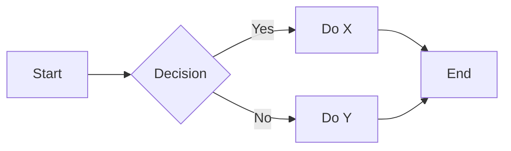
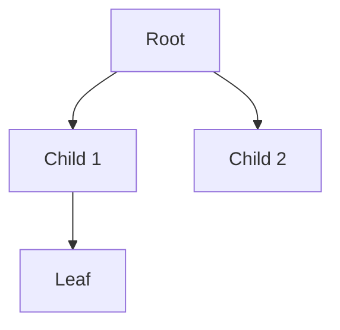
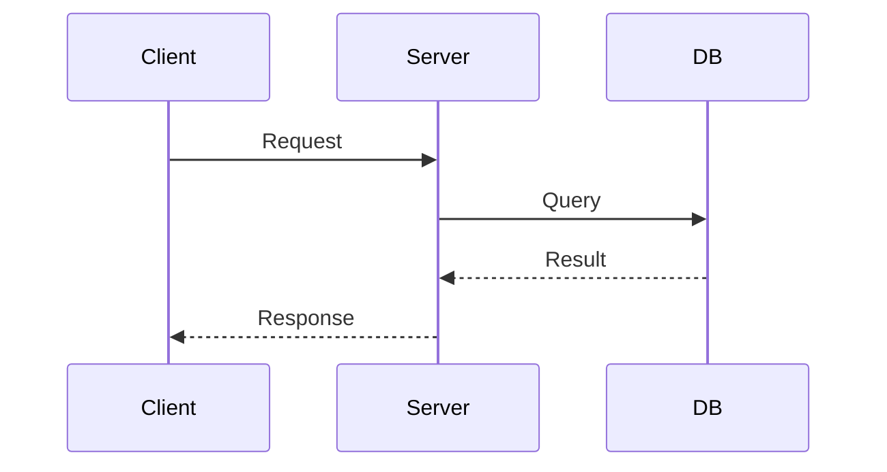
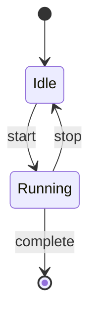

# Study Page Template

Use this template as a guide. Adapt sections freely — drop what doesn't apply, add sections that help. The goal is clarity and learnability, not rigid structure.

---

## Single-Page Template

```markdown
# [Topic]

> [1–2 sentence mental model: what is this, and why does it matter?]

---

## Key Concepts

### [Concept 1]

[1–3 sentence explanation. Keep it plain and direct.]

- Key point
- Key point
- Key point

**Example:**
\```[language]
// minimal working example
\```

---

### [Concept 2]

[Short explanation.]

\```mermaid
flowchart LR
    A[Input] --> B[Process] --> C[Output]
\```

---

### [Concept 3 — Comparison]

| | Option A | Option B |
|---|---|---|
| Use when | ... | ... |
| Pros | ... | ... |
| Cons | ... | ... |

---

## Common Patterns / How It Works

[1–3 short paragraphs or bullets showing how things fit together in practice.]

---

## Watch Out For

- **[Common mistake or gotcha]** — [why it trips people up]
- **[Edge case]** — [what to do instead]

---

## Quick Quiz

**1. [Concept check question]**

> [!note]- Answer
> [Concise answer. Add a code snippet if it helps.]
>
> ```python
> # code if needed — blank line before fence required
> ```

**2. [Apply-it question — "what happens when..."]**

> [!note]- Answer
> [Answer]

**3. [Compare/contrast question]**

> [!note]- Answer
> [Answer]

**4. [Gotcha / common mistake question]**

> [!note]- Answer
> [Answer]

---

## Dive Deeper *(optional — only if topic warrants it)*

### [Sub-topic A]

[More detail that didn't fit in the 5-minute section. Can be longer paragraphs here.]

### [Sub-topic B]

[Additional depth.]
```

---

## Multi-Page Index Template

Use this for broad topics. The index page gives the full picture; sub-pages go deep on each area.

```markdown
# [Broad Topic] — Overview

> [2–3 sentence mental model covering the whole domain.]

---

## What You'll Learn

A structured breakdown of [topic] across [N] pages:

| Page | What It Covers |
|---|---|
| [[Sub-Topic 1]] | [One-line description] |
| [[Sub-Topic 2]] | [One-line description] |
| [[Sub-Topic 3]] | [One-line description] |

---

## The Big Picture

[Short section (3–6 bullets or a diagram) showing how the sub-topics connect to each other.]

\```mermaid
graph TD
    A[Sub-Topic 1] --> B[Sub-Topic 2]
    B --> C[Sub-Topic 3]
\```

---

## Where to Start

[Recommended reading order, or which page to read based on goal.]

---

## Quick Quiz

**1. [Broad overview question spanning multiple sub-topics]**

> [!note]- Answer
> [Answer]

**2. [Another overview question]**

> [!note]- Answer
> [Answer]
```

---

## Sub-Page Template

Each sub-page follows the single-page template above, but also includes navigation at the top and bottom:

```markdown
# [Sub-Topic]

← [[Topic - Overview]] | → [[Next Sub-Topic]]

> [Mental model for this sub-topic]

[... rest of single-page template ...]

---

← [[Topic - Overview]] | → [[Next Sub-Topic]]
```

---

## Mermaid Cheatsheet

**Flowchart (process/flow):**


**Graph top-down (hierarchy/tree):**


**Sequence (interactions between components):**


**State diagram:**

